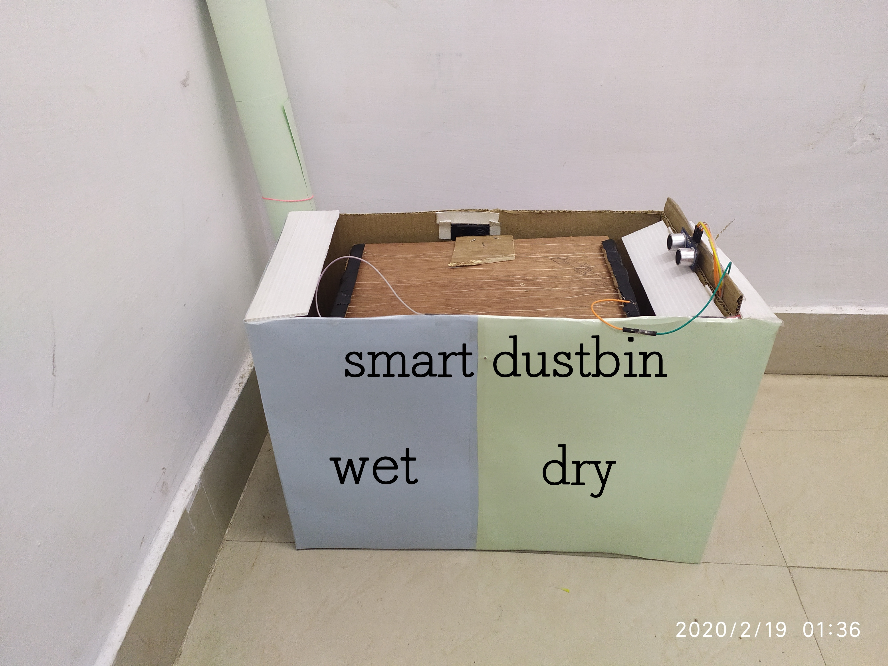

<h1 align="center">Smart Bin</h1>

# Introduction
PROSANG'20 Project-Smart dustbin using Arduino UNO and nodeMCU.
## Table of Contents:
* Project Description
* How it works?
* Go-through Videos
* Components used
## Project Description
Technology always help mankind in making life easier. Now presenting 
an innovative way which revolutionize the trash management system 
through this we are taking a step towards clean India.
Smart dustbin is easy and simple solution of segregation of two types 
of wastes dry and wet. It is designed to sort the trash into wet waste 
and dry waste ready to be processed separately for the next process of 
operation for this. Using Embedded technology to continuous 
monitoring the dustbin in order to check whether dustbin is full or not. 
Wireless sensors sense the amount of waste in the containers if it 
reached the maximum container capacity, sends instant messages to 
the waste management department.
## How it works?
* The component used in the Smart Dustbin System is Power Supply, IR 
Sensor,motor and Moisture Sensor. IR Sensor is connected in dustbin, it is used to 
detect the level of dustbin where dustbin is full or empty. With the Help of 
Sensors, the system can segregate the waste collected in collection point. In turn 
Controller initiates the arm to collect the waste and segregate accordingly.
* Two Separate storage based dustbin is designed for automatic waste collection 
and segregation. As soon as the IR sensor senses that garbage container reached 
its maximum capacity the message is sent through nodemcu module to the trash 
management personnel that trash box is filled completely, so that they schedule 
the trash collection based on this information. The sensor senses the content of 
the dustbin and sends the signals or the data to the ARM microcontroller then 
the microcontroller reads the data from the sensor and process the data received 
from sensor, and the same data will be sent to Dashboard section and this section 
send mail/message to respective authority person.
## Go-through Videos
[Smart Bin](https://youtu.be/iTtWZDmKTG0)
## Components used
* Nodemcu
* Aurdino uno
* Servo motor
* IR sensor
* Ultrasonic sensor
* Moisture sensor
### Feedback
Feel free to file an issue if you come across any bugs
### Made at:

